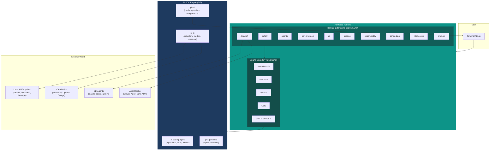
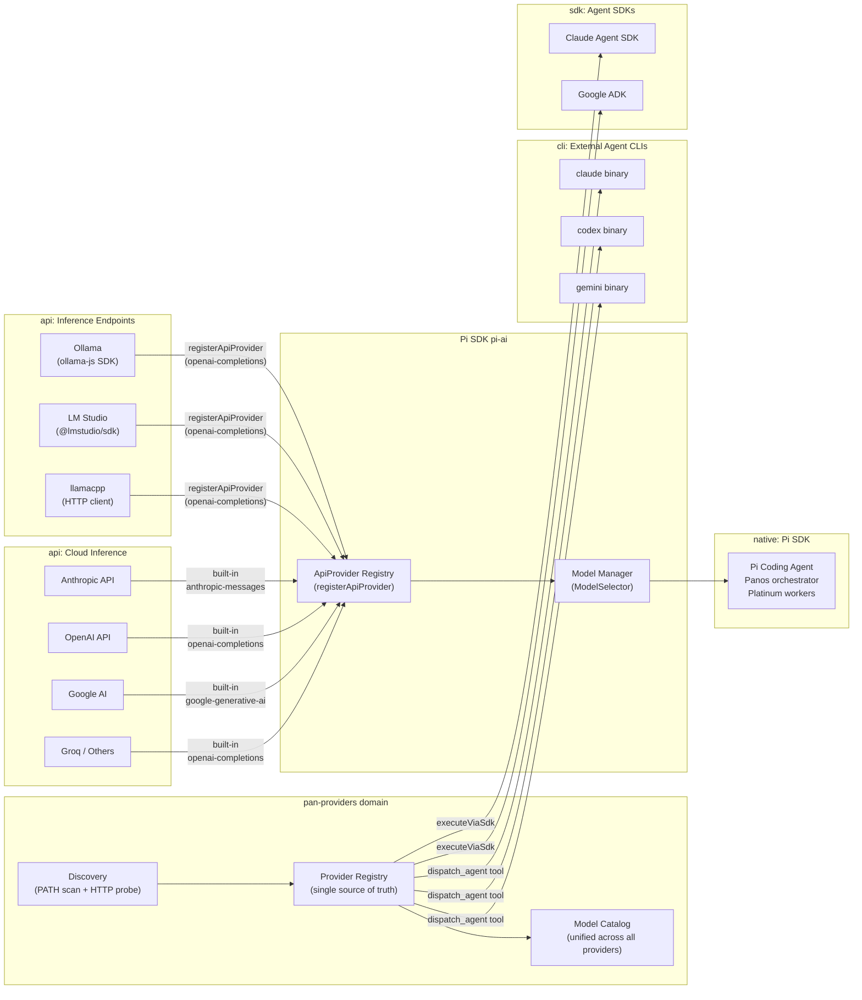
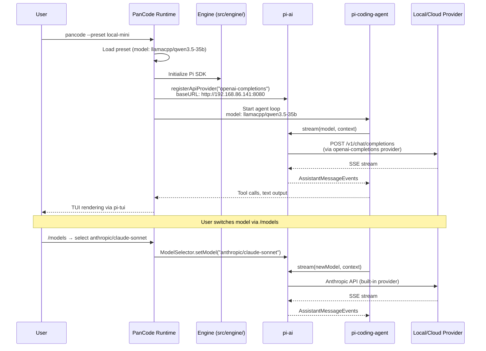
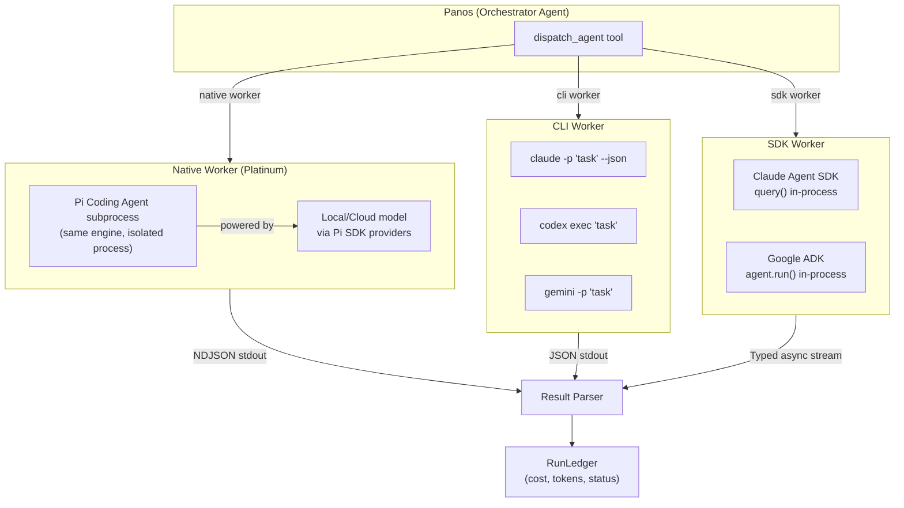
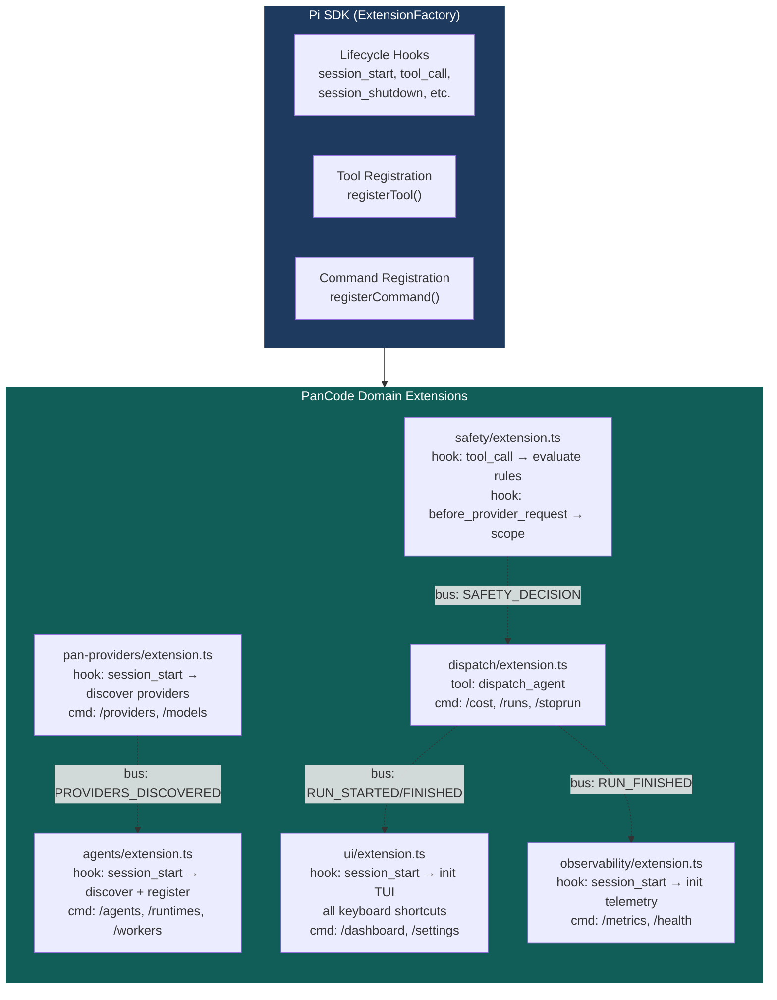

# PanCode Architecture Diagrams

## 1. Layer Cake: What Powers PanCode

**Key insight:** PanCode is an overlay of domain extensions on top of the Pi SDK engine.
The Pi SDK provides the agent loop, TUI rendering, model/provider system, and tool
framework. PanCode extends it with safety, dispatch, multi-agent orchestration,
observability, and local AI provider integration.

---

## 2. Provider Categories and Data Flow

**Key insight:** Local AI endpoints (Ollama, LM Studio, llamacpp) are registered
as Pi SDK API providers using `registerApiProvider()`. They use the `openai-completions`
API type since they all speak the OpenAI-compatible protocol. This means the Pi agent
loop can use local models natively, without any PanCode-specific inference layer.

---

## 3. How Panos Gets Powered

**Key insight:** Model switching is seamless. The Pi agent loop doesn't care whether
the model comes from a local llamacpp server or the Anthropic cloud API. PanCode's
job is to register the local endpoints as Pi providers and let the SDK handle the rest.

---

## 4. Worker Dispatch: Native vs CLI vs SDK

**Key insight:** Three distinct execution paths. Native workers use the same Pi engine
as the orchestrator (maximum telemetry, streaming, tool interception). CLI workers
are black-box subprocesses. SDK workers use programmatic APIs for typed streaming.

---

## 5. Domain Extension Architecture

**Key insight:** Every PanCode domain is a Pi SDK extension. Extensions hook into
lifecycle events and register tools/commands. Cross-domain communication goes
through SafeEventBus. The Pi SDK orchestrates the extension lifecycle.
